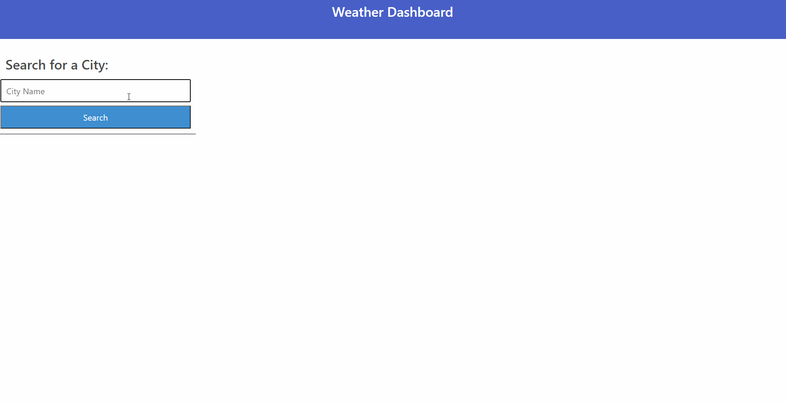

# 3-2-hw-weather-dashboard

## Description
Weather Dashbord which saves previous searches to local storage and shows current and 5 day weather conditions based off https://openweathermap.org/ API. 

## Deployed Application
https://jasonluxie.github.io/3-2-hw-weather-dashboard/

## Technologies and APIs Used 
* jQuery
* Bulma
* Luxon
* https://opencagedata.com/
* https://openweathermap.org/

## Demonstration 

<!-- ## Problem Logic
1. Creating today's weather card 
    * Empty city name and current weather info containers
    * Set Name (Date) + Icon in city container
    * Generate 4 List elements with the relevant information and append them to the current weather info list 
1. Generating 5 cards on click
    * Empty Container
    * Generate 5 cards using a loop 
    * DateTime.now().plus({ days: 1 })
1. Saving Search History
    * Event delegation on container for buttons, check if user is actually clicking on button
    * Condational Length: If container.length >= 8, then remove last (oldest) search term
    * Create New Button with value of search container
    * Prepend to container
    * Set container to local storage and get container to populate on page load  -->